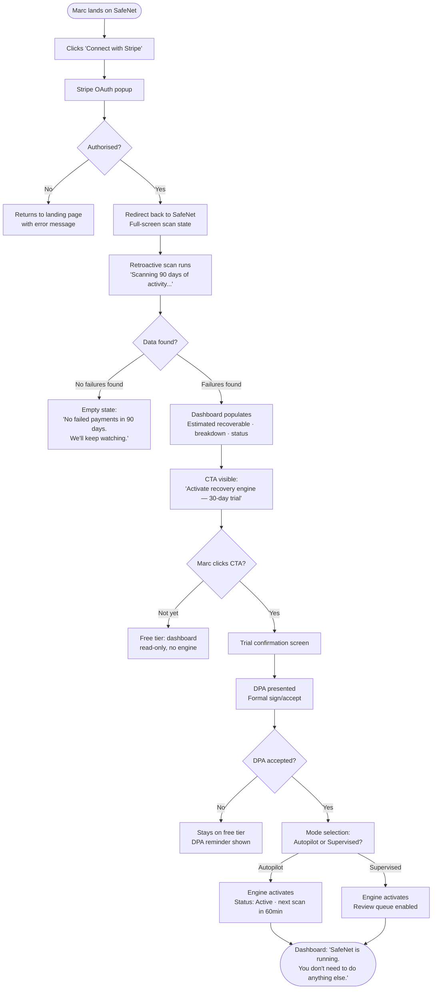
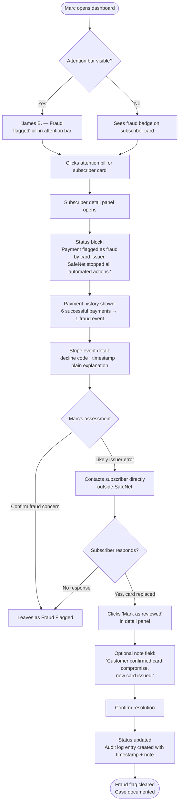
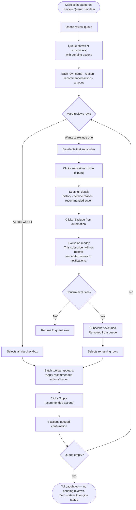
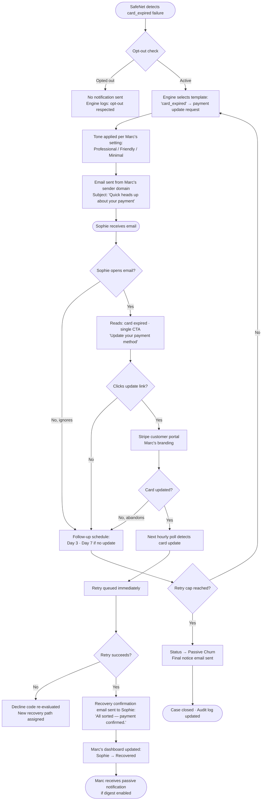

# UX Design Specification SafeNet

**Author:** BMad
**Date:** 2026-04-05

---

<!-- UX design content will be appended sequentially through collaborative workflow steps -->

## Executive Summary

### Project Vision

SafeNet is a decline-code-aware payment recovery SaaS for solo founders and small Stripe-based subscription businesses. The UX serves a single north star: in one glance, Marc knows how SafeNet is getting his money back — without needing to understand the engine behind it.

### Target Users

**Primary — The Founder (Marc)**
Solo or small team (≤5), MRR-positive on Stripe, attention-constrained. Needs at-a-glance recovery confidence, not a dashboard to manage. Non-technical in billing operations — plain language everywhere.

**Secondary — The End-Customer (Sophie)**
Subscriber unaware of billing unless it breaks. Needs a branded, human-feeling notification that feels like it came from the SaaS she trusts — not a third-party debt tool.

**Tertiary — The SafeNet Operator**
Internal admin. Needs override capability, full retry schedule visibility, and audit trail access. Power-user density acceptable here.

### Key Design Challenges

1. **Absorb technical complexity.** 30+ decline codes, compliance rules, and retry logic must vanish behind plain-language outcomes. No Stripe jargon in the founder-facing UI.

2. **Populated first-load is non-negotiable.** The retroactive scan must make the dashboard alive before Marc has taken any action. Empty states are conversion failures.

3. **Free tier as ROI calculator, not locked preview.** The "estimated recoverable revenue" figure must feel real and compelling — the UX around it should make the upgrade decision feel obvious, not coerced.

4. **Mode clarity at all times.** Supervised vs. Autopilot must be unmistakably visible. A mistaken mode assumption is a silent trust failure.

### Design Opportunities

1. **Recovery as the hero metric.** Build the dashboard around a single narrative arc: broken → fixed → earned. One bold number defines the product's emotional signature.

2. **Plain-language decline explanations.** Translate every Stripe code into a human sentence. SafeNet owns the insight layer — founders learn what happened and why, without needing to Google it.

3. **Live notification preview.** During tone selection, show Marc exactly what his subscribers will receive — with his brand name — in real time. Closes the loop between configuration and customer experience.

## Core User Experience

### Defining Experience

SafeNet's core loop is a reading, not an action. Marc opens the dashboard to *see* — recovery status at a glance, confidence that the engine is running, money accounted for. The measure of success is how quickly he can close the tab feeling informed and reassured.

The product has three active interaction moments, each with a distinct weight:

- **Stripe Connect** — zero-friction OAuth. One click, no API keys, immediate scan. The faster Marc reaches populated data, the faster trust is established.
- **Trial activation / Autopilot toggle** — a single, low-ceremony decision. Feels like flipping a switch, not configuring a system.
- **Fraud flag review** — the one moment SafeNet asks Marc to think. Must serve complete context (payment history, decline event, customer status) without overwhelming him.

### Platform Strategy

**Primary:** Desktop web — optimised for a focused, full-screen dashboard experience. Mouse and keyboard navigation. Information density calibrated for a single screen without scrolling for the most critical metrics.

**Secondary:** Responsive mobile — Marc may check recovery status on his phone. Read-only confidence-checking on mobile is a valid use case; complex actions (batch review, DPA signing) are desktop-only flows.

**Offline:** Not required. SafeNet is a live data product; stale data without connectivity is not useful.

### Effortless Interactions

- **Dashboard read** — the primary KPI (recovered this month) must be readable in under 2 seconds without any scrolling or navigation.
- **Autopilot mode** — once activated, SafeNet runs without Marc's involvement. No recurring decisions required.
- **Stripe Connect onboarding** — OAuth in one click. The retroactive scan begins immediately; Marc never sees an empty state.
- **Recovery confirmation** — Marc learns about recoveries passively (email digest, dashboard update) without needing to check in.

### Supervised Mode

Supervised is a **batch review and exclusion tool**, not a fully manual recovery flow. Marc uses it to stay in control of edge cases — not to approve every retry manually.

**Core Supervised interaction:**
- A review queue surfaces clients with pending actions (retry, email, or both), each with a recommended action based on the decline code.
- Marc can select multiple clients and apply the recommended action in bulk (batch approve).
- Marc can also exclude specific clients from automation entirely.
- Default recommendation per decline code is pre-selected — Marc confirms or overrides, never starts from scratch.

### Onboarding & DPA Flow

The Data Processing Agreement (DPA) is a **formal legal step**, presented as a distinct screen before the recovery engine activates. It is not embedded invisibly in a checkbox. Marc reads what SafeNet processes, on whose behalf, and under what terms — and explicitly signs.

**Onboarding sequence:**
1. Land on marketing site
2. Connect with Stripe (OAuth, one click)
3. Retroactive scan runs (animated, 8 seconds)
4. Dashboard populates — first insight delivered, no action required
5. CTA: "Activate recovery engine" → 30-day trial
6. DPA presented as formal step — explicit signature/acceptance
7. Autopilot / Supervised selection
8. Engine activates

### Critical Success Moments

1. **First-load populated dashboard** — The scan completes and Marc sees real numbers (failures, estimated recoverable revenue, decline breakdown) before he's done anything. This is the product's first proof of value.

2. **First recovery notification** — The email that says "Payment recovered — €X from a subscriber who updated their card" while Marc wasn't watching. This is the emotional proof that Autopilot works.

3. **30-day billing email** — "SafeNet recovered €X for you. Your plan costs €29. Net benefit: €Y." The conversion moment. The math must be undeniable.

4. **Fraud flag surface** — Marc sees a red badge, understands what happened, and trusts that SafeNet correctly stopped all automation. The absence of a bad action is itself a success moment.

### Experience Principles

1. **Recovery is the hero, not the engine.** Show outcomes in euros, not in technical operations. Marc measures SafeNet in money recovered, not retries fired.

2. **Complexity disappears at the surface.** Every Stripe decline code becomes a plain-language explanation. Every rule tree becomes a status badge. The engine's sophistication is felt, not seen.

3. **Desktop-first density, mobile-first clarity.** On desktop, pack meaningful information into a clean, scannable layout. On mobile, strip to the single number that matters most.

4. **Trust through restraint.** SafeNet does two things. The UI should reflect that — no feature sprawl, no option overload. Every screen has a clear primary action or a clear primary reading.

5. **Supervised empowers, Autopilot disappears.** Supervised mode gives Marc control without creating work — batch actions, pre-selected recommendations, frictionless exclusions. Autopilot asks nothing of him and delivers proof passively.

## Desired Emotional Response

### Primary Emotional Goals

SafeNet's emotional north star is **quiet confidence** — the feeling of having a co-pilot who handles the ugly parts of running a subscription business without drama, without asking for attention, and without ever letting anything slip.

This is not a tool Marc configures. It's a presence he trusts.

**Primary emotions by user:**
- **Marc (Founder):** Revelation → Excitement → Quiet Confidence
- **Sophie (End-customer):** Reassurance → Ease → Continuity
- **Operator:** Control → Certainty

### Emotional Journey Mapping

| Stage | Moment | Target Emotion |
|-------|--------|----------------|
| Discovery | Landing page | Intrigue — "this is different" |
| First login | Populated dashboard | Revelation + Excitement — "here's how much I can get back" |
| Trial activation | Autopilot toggle | Confidence — "I'm covered" |
| First recovery email | Passive notification | Pleasant surprise — "it worked while I wasn't watching" |
| Fraud flag | Red badge on dashboard | Calm trust — "SafeNet caught it and stopped" |
| Passive Churn | Customer graduates | Informed peace — "everything possible was done" |
| Billing email | Monthly "saved you €X" | Satisfaction + Reinforcement — "worth every euro" |
| Return visits | Weekly dashboard check | Reassurance — "still running, still working" |

### Micro-Emotions

**To cultivate:**
- **Confidence** — Marc trusts that the engine's decisions are correct
- **Revelation** — the first-login moment reframes his understanding of his own payment health
- **Quiet pride** — the product reflects well on him to his subscribers (Sophie's experience feels premium, branded, human)
- **Peace** — when a case closes as Passive Churn, Marc feels closure, not failure

**To avoid:**
- **Anxiety** — dashboards that surface problems without context create dread, not action
- **Overwhelm** — too many metrics, too many decisions, too many alerts
- **Distrust** — any false positive (wrong fraud flag, missed retry) breaks the co-pilot relationship irreparably
- **Guilt** — Passive Churn must never feel like Marc failed; it must feel like SafeNet did its job completely

### Design Implications

| Emotion | UX Design Approach |
|---------|-------------------|
| Revelation at first login | Bold, above-the-fold "estimated recoverable" figure — one number, in euros, impossible to miss |
| Excitement without alarm | Positive framing: "€640 recoverable" not "€640 lost" — opportunity language, not loss language |
| Co-pilot presence | Status indicator always visible: engine running, last scan timestamp, next scheduled action |
| Calm trust on fraud flag | Red badge with plain explanation + "SafeNet stopped all actions" — confident, not alarming |
| Informed peace on Passive Churn | Clear closure message: "All recovery paths exhausted. This subscriber has been moved to Passive Churn." No ambiguity, no implied failure |
| Quiet confidence on return | Dashboard opens to "recovered this month" — proof of work, immediate reassurance |

### Emotional Design Principles

1. **Frame every number as opportunity, not loss.** "€640 recoverable" outperforms "€640 failed" — same data, opposite emotional register. SafeNet is optimistic by default.

2. **The co-pilot is always visibly present.** Engine status, last scan time, next action — these are ambient signals that SafeNet is awake and working. Absence of these signals creates anxiety; their presence creates peace.

3. **Closure is a feature.** When a recovery path ends (Passive Churn, Fraud Flag), the UX provides a clear, dignified closing statement. Marc moves on feeling informed, not haunted.

4. **Never create alarm without context.** Red badges and warning states always appear alongside a plain-language explanation and a clear recommended next step. Alarm without context is just noise.

5. **Delight lives in the passive moments.** The most emotionally powerful SafeNet experiences happen when Marc isn't looking — the recovery email, the billing digest, the Sunday morning dashboard check that shows three more recoveries. Design for the surprise of a job well done.

## UX Pattern Analysis & Inspiration

### Core Design Philosophy: Progressive Disclosure

The guiding UX pattern for SafeNet is progressive disclosure — the practice of presenting only the information needed to answer the current question, then allowing the user to go deeper on their own terms.

SafeNet's information funnel:

**Level 1 — The Primary Answer (Dashboard overview)**
"How much am I losing / recovering in failed payments?"
→ One bold number: recovered this month. Failure landscape summary. Engine status. Nothing else competes for attention at this level.

**Level 2 — The Breakdown (Category & Status view)**
"Which types of failures are driving this? What's the current status?"
→ Failure breakdown by decline code category (plain language). Subscriber status distribution (Active / Recovered / Passive Churn / Fraud Flagged). Month-over-month trend.

**Level 3 — The Subscriber (Individual detail view)**
"What's happening with this specific person?"
→ Full payment history, decline events, actions taken, current status, manual controls if needed.

**Level 4 — The Action (Supervised review queue)**
"What do I need to approve or override?"
→ Pending actions with pre-selected recommendations. Batch controls. Exclusion management.

Each level is only reached when Marc chooses to go there. The dashboard never front-loads level 3 information onto a level 1 screen.

### Inspiring Products Analysis

No direct product references were provided. The following analysis is grounded in the stated design philosophy and established UX patterns from products that embody it well.

**Stripe Dashboard** — exemplary at level 1 clarity. Revenue, volume, failed payments — the primary questions answered immediately. Drill-down is available but never forced. SafeNet borrows: the confidence of a single authoritative number at the top, clean typographic hierarchy, subdued color palette that lets data speak.

**Linear** — masters progressive complexity. The default view is calm and uncluttered; power features surface only when the user navigates to them. No feature competes for attention until it's relevant. SafeNet borrows: the principle that density should be earned through navigation, not imposed on first load.

**Baremetrics** — gets the "aha moment" right with its retroactive data reveal. A founder connects their payment processor and immediately sees months of history. SafeNet borrows: the retroactive scan as a trust moment, not just a technical step.

### Transferable UX Patterns

**Navigation Patterns:**
- **Layered drill-down** — top nav anchors the current level; clicking a metric or subscriber card navigates one level deeper. Breadcrumb or back navigation always visible. Never a dead end.
- **Status-first grouping** — subscribers grouped by recovery status (Active, Recovered, Passive Churn, Fraud Flagged), not by date or amount. Status is the primary lens Marc cares about.

**Interaction Patterns:**
- **Progressive detail cards** — subscriber list shows name, status badge, and one key metric (amount at risk or recovered). Clicking expands or navigates to full detail. No table rows with 8 columns.
- **Batch action with pre-selection** — in Supervised mode, recommended actions are pre-selected per decline code. Marc reviews the recommendation, not a blank form. Cognitive load close to zero.
- **Ambient engine status** — a persistent, unobtrusive indicator shows engine state (running / last scan / next scheduled action). Always visible, never distracting. Like a heartbeat monitor in the corner.

**Visual Patterns:**
- **Single hero metric** — one number dominates the dashboard. All other metrics support it, never compete with it.
- **Plain-language status badges** — "Recovered", "Update requested", "Fraud flagged", "Subscription ended". No codes, no jargon.
- **Optimistic color language** — green for recovered/positive, neutral grey for in-progress, muted red only for fraud flags and genuine blockers. Not every failed payment is red — it's an opportunity in progress.

### Anti-Patterns to Avoid

- **Transaction-first views** — showing a list of payment events instead of a list of subscribers. Marc thinks in people, not transactions. A subscriber with 3 retry attempts is one person, not 3 rows.
- **Alert inflation** — surfacing every engine action as a notification. The engine running correctly is not news. Only exceptions (fraud flag, Passive Churn graduation, retry cap reached) warrant surfacing.
- **Feature sprawl on first load** — settings panels, configuration options, and advanced controls visible on the main dashboard create the impression of complexity before Marc has understood the basics.
- **Loss framing** — "€640 in failed payments" reads as a problem Marc caused. "€640 recoverable" reads as an opportunity SafeNet will handle. Same number, entirely different emotional register.
- **Jargon leakage** — decline codes, retry caps, state machine terminology must never appear in the founder-facing UI. These belong in the engine, not the dashboard.

### Design Inspiration Strategy

**Adopt:**
- Progressive disclosure as the primary navigation architecture
- Single hero metric at every level (level 1: recovered this month; level 2: top decline code category; level 3: amount at risk per subscriber)
- Subscriber-centric data model in the UI — people, not transactions
- Ambient engine status indicator — always present, never intrusive

**Adapt:**
- Stripe's typographic clarity — apply to a recovery-specific information hierarchy rather than a general payments context
- Linear's earned complexity — surface power features (Supervised queue, admin overrides, audit log) only when navigated to, never on the primary view

**Avoid:**
- Any pattern that requires Marc to parse technical information to understand his recovery status
- Notification-heavy interfaces that train users to dismiss alerts
- Dashboard designs that feel like control panels — SafeNet is a co-pilot, not a cockpit

## Design System Foundation

### Design System Choice

**Selected:** shadcn/ui + Tailwind CSS (React)

shadcn/ui provides a curated set of accessible, composable components built on Radix UI primitives. Components are copied into the project (not imported as a dependency), giving full ownership and customisation control. Tailwind CSS handles all styling through utility classes, enabling rapid iteration without fighting a framework.

### Rationale for Selection

- **React-native fit** — shadcn/ui is purpose-built for React; no adaptation layer needed.
- **Ownership model** — components live in the codebase, not in node_modules. No upstream breaking changes.
- **Minimal by default** — ships with zero visual opinions beyond clean, accessible defaults. Matches SafeNet's restraint-as-trust-signal design philosophy.
- **Data dashboard patterns** — tables, cards, badges, popovers, and command menus are first-class citizens. Exactly the component set SafeNet needs.
- **Solo founder velocity** — fast to build, easy to maintain, well-documented. No designer required to keep things consistent.

### Brand Identity Direction

No existing brand identity. The following direction is defined as part of this UX specification.

**Brand character:** Slick, clean, professional. SafeNet should feel equally at home on the screen of a business-oriented founder who thinks in MRR and a technical founder who reads Stripe docs for fun. The visual language is precise, confident, and uncluttered.

**Theme strategy:** Light mode as default. Dark mode as user preference, fully supported and equally polished. Both modes are first-class — no feature or layout compromise in either.

**Design token system (mode-agnostic naming):**

| Token | Light Mode | Dark Mode | Usage |
|-------|-----------|-----------|-------|
| `--bg-base` | `#FFFFFF` | `#0F1117` | Page background |
| `--bg-surface` | `#F8F9FB` | `#1A1D27` | Cards, panels |
| `--bg-elevated` | `#F0F2F7` | `#22263A` | Hover states, nested surfaces |
| `--border` | `#E2E5EF` | `#2A2D3A` | Dividers, card borders |
| `--text-primary` | `#0D0F1A` | `#F0F2F7` | Headlines, key data |
| `--text-secondary` | `#6B7280` | `#8B8FA8` | Labels, supporting copy |
| `--text-tertiary` | `#9CA3AF` | `#5C6070` | Timestamps, metadata |
| `--accent-recovery` | `#16A34A` | `#22C55E` | Recovered amounts, positive states |
| `--accent-active` | `#2563EB` | `#3B82F6` | In-progress, engine running |
| `--accent-fraud` | `#DC2626` | `#EF4444` | Fraud flags only — used sparingly |
| `--accent-neutral` | `#6B7280` | `#6B7280` | Passive Churn, closed states |
| `--cta` | `#0F172A` | `#F0F2F7` | Primary CTA (dark on light / light on dark) |
| `--cta-hover` | `#1E293B` | `#FFFFFF` | CTA hover state |

**CTA rationale:** A near-black CTA on light mode and near-white on dark mode signals authority and restraint — not a startup accent color. It reads as professional fintech, not developer tooling. The single conversion action ("Activate recovery engine") earns its weight through contrast, not color.

**The spectrum test:** Every component should pass a two-person review:
- Would a non-technical founder trust this with their payment data?
- Would a technical founder feel the quality in the implementation?
If both answers are yes, the design is right.

**Typography:**

| Role | Font | Weight | Size |
|------|------|--------|------|
| Hero metric | Inter | 700 (Bold) | 48–64px |
| Section headers | Inter | 600 (SemiBold) | 20–24px |
| Body / labels | Inter | 400 (Regular) | 14–16px |
| Supporting copy | Inter | 400 (Regular) | 12–13px |
| Status badges | Inter | 500 (Medium) | 11–12px |

**Spacing & Density:** Desktop-first layout with comfortable information density. Base spacing unit: 4px. Primary content max-width: 1280px. Sidebar: 240px fixed. Main content area: fluid.

### Implementation Approach

1. Initialise shadcn/ui in the React project with the neutral theme as base
2. Define CSS custom properties for all design tokens in both light and dark variants; wire to shadcn/ui's built-in theme switching
3. Add Inter via Google Fonts or self-hosted for performance
4. Extend Tailwind config with SafeNet's semantic token aliases
5. Build `StatusBadge` first — it appears everywhere and encodes the plain-language status vocabulary

### Customisation Strategy

**Keep from shadcn/ui defaults:**
- Button variants (primary, secondary, ghost, destructive)
- Form inputs and validation states
- Dialog / Sheet components (for subscriber detail panels)
- Table component (subscriber list view)
- Toast notifications (passive recovery alerts)

**Customise:**
- Card components — apply SafeNet surface tokens and border treatment
- Badge component — extend with SafeNet's 4 status variants (Recovered, Active, Passive Churn, Fraud Flagged)

**Build custom:**
- `EngineStatusBar` — ambient indicator: engine state, last scan, next action
- `RecoveryHeroCard` — dominant "recovered this month" display
- `DeclineCodeExplainer` — plain-language translation of Stripe codes
- `BatchActionToolbar` — Supervised mode multi-select controls

## 2. Core User Experience

### 2.1 Defining Experience

SafeNet's defining experience is the **scan-to-clarity loop**: from connecting Stripe to having a complete, human-readable picture of payment health — with zero manual work and no prior knowledge required.

**At first login:**
Connect with Stripe → 8-second retroactive scan → populated dashboard showing 90 days of failure history, estimated recoverable revenue, and decline breakdown in plain language.

**On every return visit:**
Open dashboard → see recovered amount, engine status, and any exceptions requiring attention — all above the fold, in under 5 seconds.

The product's magic is not in what Marc does — it's in what he *doesn't* have to do. SafeNet's defining experience is the experience of things happening correctly without him.

### 2.2 User Mental Model

**Current mental model (before SafeNet):**
Failed payments are a problem to chase. Marc knows they exist, suspects they're costing him money, but doesn't know how many, which kind, or what to do about each one. His solution is either manual Stripe checking (anxiety-driven, inconsistent) or ignoring the problem entirely.

**Mental model SafeNet installs:**
Failed payments are a categorised recovery opportunity, not an undifferentiated problem. Each failure has a reason, and each reason has a fix. The engine handles the fix. Marc sees the outcome.

**Where confusion is likely:**
- The distinction between Supervised and Autopilot modes at activation — clear labelling and a concrete explanation of what each mode means for his subscribers is essential
- The Fraud Flagged status — Marc may initially read "fraud" as something he or his subscriber did wrong. The UI must immediately reframe: this is a card issuer signal, and SafeNet's correct response is to stop, not act
- Passive Churn graduation — Marc may read this as "subscriber lost." The UI frames it as: SafeNet completed its full recovery sequence; the outcome is documented and closed

### 2.3 Success Criteria

**First-login scan:**
- Dashboard never shows an empty state after Stripe Connect authorisation
- Estimated recoverable revenue figure is visible before Marc scrolls
- Every decline code shown has a plain-language explanation beside it
- Time from OAuth callback to populated dashboard: ≤15 seconds

**Ongoing use:**
- Primary KPI (recovered this month) readable in <2 seconds on return visit
- Engine status visible at all times — Marc never has to "check if it's running"
- Supervised review queue completable in <2 minutes for typical batch size
- Fraud flag state immediately legible — no ambiguity about what happened and what SafeNet did

**Emotional success:**
- Marc closes the tab without anxiety
- Marc receives the recovery email and feels pleasant surprise, not confusion
- Marc shows the billing digest email to another founder as social proof

### 2.4 Novel UX Patterns

**Established patterns used (familiar, no education required):**
- OAuth connect flow — identical to every Stripe integration Marc has seen
- Card/list navigation — standard dashboard drill-down
- Status badges — universal data table pattern
- Sheet/drawer for detail panels — common in modern B2B SaaS
- Batch select with toolbar — familiar from email clients and CRMs

**Novel patterns requiring clear affordance:**

1. **Retroactive scan as onboarding moment** — most tools start from "now." SafeNet scans 90 days back on first connect. The scan animation must communicate that something meaningful is happening, not just loading. The reveal must feel like a gift, not a report.

2. **Status-centric subscriber view** — SafeNet organises subscribers by recovery status, not by transaction date or amount. This is a different mental model from Stripe's transaction log. A brief orientation label ("Your subscribers, grouped by recovery status") resolves this on first encounter.

3. **Pre-selected batch recommendations** — Supervised mode presents pending actions with the recommended action already selected per decline code. This is a novel variant of standard approval flows. The UI must make clear that the recommendation comes from the decline-code rule engine, not a random default.

### 2.5 Experience Mechanics

#### The First-Login Scan

**Initiation:** Marc clicks "Connect with Stripe" on the landing page or onboarding screen. Standard OAuth popup. One authorisation click.

**Interaction:** Redirect back to SafeNet. Full-screen scan state — animated progress, single message: *"Scanning your last 90 days of payment activity."* No partial data, no skeleton screens. The scan completes as a unit.

**Feedback:** Dashboard populates in a single reveal — not piece by piece. Hero metric appears first (estimated recoverable revenue). Failure breakdown appears below. A brief callout highlights the largest opportunity category.

**Completion:** Dashboard is live. A subtle prompt: *"Your recovery engine is ready. Start your 30-day trial."* The CTA is anchored below the estimated recoverable figure — the math is always visible when Marc makes the decision.

---

#### The Autopilot Activation

**Initiation:** Marc clicks "Activate recovery engine" CTA.

**Interaction:** Trial confirmation screen → DPA presented as formal document with explicit sign/accept action → Mode selection: Autopilot or Supervised, with plain-language explanation of each.

**Feedback:** Engine activates. Dashboard shows engine status indicator: *"Active — next scan in [X] minutes."* Confirmation message: *"SafeNet is now running. You don't need to do anything else."*

**Completion:** Marc is done. The tab can close. SafeNet works.

---

#### The Supervised Review Queue

**Initiation:** Marc navigates to the Supervised queue (sidebar nav or dashboard prompt when pending actions exist). Badge count on nav item indicates pending reviews.

**Interaction:** List of subscribers with pending actions. Each row shows: subscriber name, decline reason (plain language), recommended action (pre-selected), and amount at risk. Multi-select checkboxes on the left. Batch action toolbar appears on selection: "Apply recommended actions" / "Exclude from automation."

**Feedback:** Selected action confirmed with count — *"3 actions queued."* Rows clear from the queue as actions are confirmed. Zero-state message when queue is empty: *"All caught up — no pending reviews."*

**Completion:** Queue is empty. Marc returns to dashboard.

---

#### The Fraud Flag Encounter

**Initiation:** Marc notices a red "Fraud flagged" badge on a subscriber card in the dashboard or subscriber list.

**Interaction:** Clicking the subscriber opens the detail panel. Top of panel shows a clear status block: *"Payment flagged as fraud by card issuer. SafeNet has stopped all automated actions for this subscriber."* Below: full payment history, the specific Stripe event, a plain-language explanation of what the decline code means.

**Feedback:** The panel makes explicit what SafeNet did and did not do. A manual resolution option is available: "Mark as reviewed" with an optional note field for the audit log.

**Completion:** Marc marks as reviewed. The subscriber's status updates. The audit trail records the manual resolution with timestamp.

## Visual Design Foundation

### Color System

The color system is defined via CSS custom properties (see Design System Foundation — Brand Identity Direction for the full token table). The semantic layer below maps those tokens to functional roles used throughout the UI.

**Semantic color roles:**

| Role | Light token | Dark token | When to use |
|------|------------|------------|-------------|
| Page background | `#FFFFFF` | `#0F1117` | App shell, full-bleed areas |
| Card / panel surface | `#F8F9FB` | `#1A1D27` | Content containers |
| Hover / elevated | `#F0F2F7` | `#22263A` | Hover states, nested content |
| Primary text | `#0D0F1A` | `#F0F2F7` | Headlines, KPI numbers, labels |
| Secondary text | `#6B7280` | `#8B8FA8` | Supporting labels, timestamps |
| Dividers / borders | `#E2E5EF` | `#2A2D3A` | Card edges, section separators |
| Recovery / success | `#16A34A` / `#22C55E` | — | Recovered amounts, positive outcomes |
| Active / in-progress | `#2563EB` / `#3B82F6` | — | Engine running, retries queued |
| Fraud / critical | `#DC2626` / `#EF4444` | — | Fraud flags only — never for general warnings |
| Neutral / closed | `#6B7280` | — | Passive Churn, historical closed states |
| Primary CTA | `#0F172A` | `#F0F2F7` | Single primary action per screen |

**Contrast compliance (WCAG AA minimum):**
- Primary text on background: ≥7:1 (AAA) in both modes
- Secondary text on background: ≥4.5:1 (AA) in both modes
- Recovery green on surface (light): verified ≥3:1 for large text / badge usage; pair with text label for critical states
- Fraud red on surface: always paired with text label — never colour-only communication

**Colour discipline rules:**
- Recovery green is reserved exclusively for positive recovery outcomes. Do not use for other "positive" states (e.g. form validation).
- Fraud red appears only on the Fraud Flagged status. It must never trigger anxiety about normal failed payments — those are opportunities, not emergencies.
- CTA colour (near-black / near-white) is used for exactly one action per screen. Secondary actions use ghost or outlined variants.

### Typography System

**Typeface:** Inter (variable font, self-hosted or Google Fonts CDN)

**Type scale:**

| Level | Size | Weight | Line height | Usage |
|-------|------|--------|-------------|-------|
| Hero | 56px | 700 | 1.1 | Recovered amount KPI, first-login reveal |
| Display | 36px | 700 | 1.2 | Section hero numbers, scan reveal |
| H1 | 24px | 600 | 1.3 | Page titles |
| H2 | 20px | 600 | 1.35 | Section headers, card titles |
| H3 | 16px | 600 | 1.4 | Sub-section labels |
| Body | 15px | 400 | 1.6 | Primary readable content |
| Small | 13px | 400 | 1.5 | Supporting copy, metadata |
| Label | 12px | 500 | 1.4 | Status badges, table column headers |
| Micro | 11px | 400 | 1.4 | Timestamps, footnotes |

**Number rendering:**
All monetary values use `font-variant-numeric: tabular-nums` — ensures euro amounts align vertically in lists and tables. Hero KPI numbers use `font-feature-settings: "tnum"` explicitly.

**Plain-language principle:**
All user-facing text is written at a reading level accessible to a non-technical founder. Decline code explanations, status descriptions, and system messages are reviewed against this standard before shipping.

### Spacing & Layout Foundation

**Base unit:** 4px

**Spacing scale (Tailwind-compatible):**

| Token | Value | Usage |
|-------|-------|-------|
| `space-1` | 4px | Tight inline spacing (badge padding, icon gap) |
| `space-2` | 8px | Component internal padding |
| `space-3` | 12px | Small gaps between related elements |
| `space-4` | 16px | Standard component padding |
| `space-6` | 24px | Section internal spacing |
| `space-8` | 32px | Between sections within a card |
| `space-12` | 48px | Between major page sections |
| `space-16` | 64px | Page-level vertical rhythm |

**Layout structure (desktop primary):**

```
┌─────────────────────────────────────────────────┐
│  Top bar: logo + engine status + theme + account │  48px
├───────────┬─────────────────────────────────────┤
│           │                                     │
│  Sidebar  │         Main content area           │
│  240px    │         fluid, max 1280px            │
│  fixed    │         padding: 32px               │
│           │                                     │
└───────────┴─────────────────────────────────────┘
```

- **Sidebar:** Fixed 240px. Navigation items, engine status indicator, mode toggle (Autopilot / Supervised). Collapses to icon rail on narrower viewports.
- **Main content:** Fluid within max-width 1280px. 32px padding on all sides. Hero metric area occupies full width at top. Content below follows a 12-column grid with 24px gutters.
- **Cards:** Standard border-radius 8px. Border `1px solid --border`. Padding 24px. No drop shadows — borders only. Consistent with the "restrained, precise" brand character.

**Responsive breakpoints:**

| Breakpoint | Width | Layout change |
|------------|-------|---------------|
| Desktop | ≥1280px | Full sidebar + main content |
| Laptop | 1024–1279px | Sidebar condensed to 200px |
| Tablet | 768–1023px | Sidebar collapses to icon rail |
| Mobile | <768px | Sidebar hidden, top nav. Read-only optimised. |

### Accessibility Considerations

- **Colour-blind safe:** No information is conveyed by colour alone. Every status (Recovered, Active, Passive Churn, Fraud Flagged) has a text label alongside its colour badge.
- **Focus states:** All interactive elements have visible focus rings using `--accent-active` colour — keyboard navigation fully supported.
- **Motion:** Scan animation and reveal transitions respect `prefers-reduced-motion`. Functional feedback (success/error states) never relies on animation alone.
- **Screen reader support:** All status badges include `aria-label` with full status text. KPI numbers include `aria-label` with currency and context (e.g. "€310 recovered this month").
- **Font size floor:** No text below 11px in production UI. Body text minimum 15px for comfortable reading on high-DPI displays.

## Design Direction Decision

### Design Directions Explored

Four directions were generated and evaluated:

| # | Name | Character |
|---|------|-----------|
| 1 | Hero First | Light · ultra-clean · sidebar nav · recovery number dominates |
| 2 | Command Bar | Dark · dense · table-driven · technical founder focus |
| 3 | Story Arc | Light · top nav · 3-column narrative funnel |
| 4 | Calm Authority | Light · spacious · premium · sidebar + list hybrid |

Interactive mockups saved at: `_bmad-output/ux-design-directions.html`

### Chosen Direction

**Story Arc — Refined**

The 3-column narrative layout (Detected → In progress → Recovered) selected for its clear progressive disclosure architecture. The funnel directly answers SafeNet's primary question at a glance: what was found, what is being done, what was recovered.

**Refinements applied from review:**
1. **Workspace identity in topbar** — SafeNet logo paired with founder's SaaS name and a branded monogram. Makes SafeNet feel embedded in Marc's product, not external to it.
2. **Estimated recoverable as column 2 hero** — `€640` displayed at 52px bold alongside recovery rate (43%) as prominent secondary KPI. Competes directly with the recovered amount in visual weight.
3. **Persistent attention bar** — Amber strip below topbar when items require action. Names items explicitly with time context ("Review before next engine cycle in 42 min"). Fraud-flagged subscriber cards use amber border and `⚠` label; appear first in the subscriber grid.

### Design Rationale

- **Funnel = progressive disclosure in visual form.** The 3-column layout maps directly to SafeNet's information levels — Marc reads left to right and naturally drills deeper only if he wants to.
- **Both KPIs earned equal visual weight.** "Recovered this month" (proof of value) and "Estimated recoverable" (incentive to act) are now both hero-sized numbers. Neither is subordinated.
- **Attention items are impossible to miss.** The amber bar and orange-tinted subscriber cards create a clear visual hierarchy: these items require action before anything else.
- **Identity makes SafeNet feel personal.** Marc sees "ProductivityPro" in the topbar — SafeNet is working *for his SaaS*, not generically for some abstract account.

### Implementation Notes

- Top nav (horizontal) replaces sidebar for founder-facing screens. Sidebar reserved for operator/admin views.
- 3-column arc uses CSS Grid with 1px gap on `#E2E5EF` background to create hairline dividers between columns.
- Attention bar is conditionally rendered — hidden when no items require attention, visible with count when they do.
- Subscriber cards use a 3-column grid. Attention-state cards always render first regardless of sort order.

## User Journey Flows

### Journey 1: Onboarding & First Insight

**Goal:** Marc connects Stripe and sees his payment health picture for the first time — before he's done anything else.



**UX notes:**
- Scan screen is full-screen, no partial data shown during scan
- Dashboard populates in a single reveal — not incrementally
- CTA is anchored directly below the estimated recoverable figure
- DPA is a distinct screen, never a checkbox in a form
- Mode selection uses plain language: "Approve each action manually" vs. "SafeNet handles everything"
- Post-activation message is reassuring, not instructional

---

### Journey 2: Fraud Flag Encounter

**Goal:** Marc discovers a fraud-flagged subscriber, understands what happened, and resolves the case with confidence.



**UX notes:**
- Attention bar names the subscriber directly — not a generic "1 item requires review"
- Detail panel leads with SafeNet's action (stopped), not with the problem
- Payment history makes the anomaly visible without Marc having to interpret raw data
- Plain-language explanation of the decline code is always shown
- "Mark as reviewed" is the only action available — no retry, no re-enable automation
- Note field is optional but defaults to cursor-focused to encourage documentation

---

### Journey 3: Supervised Review Queue

**Goal:** Marc reviews pending actions in Supervised mode, approves recommendations in bulk, and excludes one subscriber.



**UX notes:**
- Default state: all rows pre-selected with recommended action pre-filled
- Marc's job is to *review*, not to *configure* — the engine does the thinking
- Batch toolbar appears only when rows are selected; disappears when none are
- Exclusion requires a confirmation step — it's irreversible from the queue
- Zero-state is calm and reassuring, not empty-feeling

---

### Journey 4: End-Customer Notification Flow (Sophie)

**Goal:** Sophie receives a payment notification, updates her card, and her subscription continues without friction.



**UX notes (Sophie-facing):**
- Email sender is Marc's brand, not SafeNet — Sophie has no awareness of SafeNet
- Subject line is understated — no urgency language, no threat of account suspension
- Opt-out link is visible but not prominent — GDPR-compliant, not anxiety-inducing
- "Your access continues while you update" is stated explicitly in every card-expired email
- Recovery confirmation is brief — two sentences maximum

---

### Journey Patterns

**Entry patterns:**
- Passive discovery (attention bar, nav badge) → reactive flow
- Active navigation (returning to dashboard) → read-only confidence loop
- External trigger (email notification) → app re-entry at relevant screen

**Decision patterns:**
- Engine pre-selects the recommended action — Marc accepts or overrides, never starts blank
- Confirmation steps protect irreversible actions (exclusion, DPA acceptance)
- Every decision has a plain-language consequence statement before confirmation

**Feedback patterns:**
- Immediate: action confirmation toast ("3 actions queued")
- Ambient: engine status indicator always updated
- Passive: email digest and recovery notifications for out-of-app proof
- Closure: zero-state screens are affirming, not empty ("All caught up")

**Error recovery patterns:**
- OAuth failure → returns to landing with specific error message + retry option
- Retry failure → decline code re-evaluated, new path assigned (never silent failure)
- DPA rejected → stays on free tier, reminder shown non-intrusively on next login
- Opt-out respected → no notification sent, always logged in audit trail

### Flow Optimisation Principles

1. **Pre-select, don't prompt.** Every flow where Marc must make a decision arrives with a recommended answer already populated. He reviews, not configures.

2. **Failures are paths, not dead ends.** Every failure state (retry failed, subscriber opted out, DPA rejected) has an explicit next step. No flow ends in an ambiguous error.

3. **Passive proof over active dashboards.** The most important feedback moments (recovery email, billing digest) happen outside the app. The dashboard confirms what already happened — it doesn't require Marc's attention to function.

4. **One irreversible action per flow, protected by confirmation.** DPA acceptance, subscriber exclusion, and fraud flag resolution each have a single confirmation step. No accidental irreversible actions.

## Component Strategy

### Design System Components

**Used from shadcn/ui as-is (themed only):**

| Component | Used for |
|-----------|----------|
| `Button` | All CTAs — primary (near-black/near-white), ghost, destructive |
| `Input` / `Textarea` | Search, note field in fraud resolution, DPA form |
| `Dialog` | DPA presentation, exclusion confirmation, mode selection |
| `Sheet` | Subscriber detail panel (slides in from right) |
| `Table` | Subscriber list in Supervised review queue |
| `Checkbox` | Batch row selection in review queue |
| `Toast` | Action confirmations ("3 actions queued"), recovery notifications |
| `Badge` | Base component for status variants |
| `Separator` | Section dividers in detail panels |
| `Popover` | Decline code explanation tooltips |
| `Select` | Filter dropdowns (status, date range) |
| `Avatar` | Subscriber initials in list and detail views |

**Customised shadcn/ui (extended with SafeNet tokens):**

| Component | Customisation |
|-----------|--------------|
| `Badge` | Extended with 4 SafeNet status variants: Recovered (green), Active (blue), Fraud Flagged (red), Passive Churn (grey) |
| `Card` | Surface token applied, border-only (no shadow), 8px radius |
| `NavigationMenu` | Styled as horizontal top nav with active state underline |

### Custom Components

#### `RecoveryHeroCard`

**Purpose:** Displays the dominant "recovered this month" figure. The product's emotional signature — the first thing Marc sees on every dashboard visit.

**Anatomy:**
- Eyebrow label: "Recovered this month" (12px, secondary text)
- Hero amount: large bold green number (56px Inter 700)
- Supporting line: "N successful retries · Net benefit: €X" (14px, secondary)
- Optional upgrade CTA embedded below (free tier only)

**States:** Default · Free tier (shows estimated recoverable instead, with trial CTA) · Loading (skeleton)

**Accessibility:** `aria-label="€310 recovered this month from 4 successful retries"`

---

#### `StoryArcPanel`

**Purpose:** The 3-column narrative funnel (Detected → In progress → Recovered). SafeNet's primary information architecture component.

**Anatomy:**
- 3 columns via CSS Grid, 1px hairline dividers
- Each column: step indicator (numbered badge + label) · title · hero metric · supporting KPIs · item list
- Column 1 (Detected): neutral metric colour
- Column 2 (In progress): blue metric, includes estimated recoverable + recovery rate + secondary KPIs
- Column 3 (Recovered): green background tint, green metric

**States:** Default · Scan loading (skeleton columns) · Zero state (no failures found)

**Variants:** Full (all 3 columns) · Compact (reduced padding for smaller viewports)

**Accessibility:** Each column has `role="region"` with descriptive `aria-label`

---

#### `AttentionBar`

**Purpose:** Persistent amber strip below topbar surfacing items requiring Marc's immediate attention. Conditionally rendered — invisible when queue is clear.

**Anatomy:**
- Icon: amber warning square (left)
- Title: "N items need your attention" (bold, dark amber)
- Subtitle: "Review before next engine cycle in Xm" (lighter amber)
- Action pills: named items as clickable chips (one per attention item)

**States:** Visible (1+ items) · Hidden (zero items) · Urgent (fraud flag present — slightly deeper amber)

**Behaviour:** Clicking a pill navigates to the relevant subscriber detail or review queue. Dismissible per session (not permanently).

**Accessibility:** `role="alert"` with `aria-live="polite"` · Pills are `<button>` elements with full keyboard navigation

---

#### `EngineStatusIndicator`

**Purpose:** Ambient always-visible signal that the engine is running. Never obtrusive; immediately reassuring on return visits.

**Anatomy:**
- Animated pulse dot (blue when active, grey when paused)
- Status text: "Autopilot active" or "Supervised" or "Paused"
- Sub-text: "Last scan Xm ago · next in Ym"

**Placement:** Top navigation bar (right of workspace identity, left of user menu) on all authenticated screens.

**States:** Active (blue pulse) · Paused (grey, static) · Error (amber, static — engine failed to run)

**Accessibility:** `aria-label="Engine status: Autopilot active, last scan 18 minutes ago"` · Status changes announced via `aria-live="polite"`

---

#### `WorkspaceIdentity`

**Purpose:** Displays SafeNet logo paired with Marc's SaaS name, making the tool feel embedded in his product rather than external.

**Anatomy:**
- SafeNet wordmark
- Vertical divider
- SaaS monogram (2-letter avatar, dark background)
- SaaS name (bold, 13px)
- "Marc's workspace" sub-label (secondary, 12px)

**Placement:** Top navigation bar, left-anchored. Always visible on authenticated screens.

**States:** Default · Loading (skeleton while workspace data loads)

---

#### `DeclineCodeExplainer`

**Purpose:** Translates Stripe decline codes into plain-language explanations wherever they appear. Prevents jargon leakage into the founder-facing UI.

**Anatomy:**
- Code label (hidden from UI — internal reference only)
- Human label: "Card expired", "Insufficient funds", etc. (shown in all UI contexts)
- Explanation popover (on hover/focus): one sentence explaining what this means and what SafeNet will do

**Examples:**
- `card_expired` → "Card expired" → "This card is no longer valid. SafeNet has sent a payment update request to your subscriber."
- `insufficient_funds` → "Insufficient funds" → "Your subscriber's account didn't have enough funds. SafeNet will retry after the next likely payday."
- `fraudulent` → "Fraud flagged" → "The card issuer flagged this as a potential fraud event. SafeNet has stopped all automated actions."

**Used in:** Subscriber list rows · Detail panel · StoryArcPanel breakdown · Review queue

---

#### `BatchActionToolbar`

**Purpose:** Appears when rows are selected in the Supervised review queue. Provides Marc with one-click bulk actions without cognitive overhead.

**Anatomy:**
- Selection count: "N subscribers selected"
- Primary action button: "Apply recommended actions" (near-black CTA)
- Secondary action: "Exclude from automation" (ghost/destructive variant)
- Deselect all link

**States:** Hidden (no selection) · Visible (1+ selected) · Partial selection indicator

**Behaviour:** Slides up from bottom of queue on selection. Sticky within the queue viewport. Disappears on deselect-all.

**Accessibility:** `role="toolbar"` · All buttons keyboard-accessible · Selection count announced via `aria-live`

---

#### `SubscriberCard`

**Purpose:** Card-format subscriber display in the Story Arc dashboard view. Progressive — shows name, status, reason, and amount at a glance; expands to detail on click.

**Anatomy:**
- Top row: subscriber name (bold) + amount (right-aligned)
- Sub-label: email or subscription tier
- Bottom row: plain-language decline reason + status badge

**States:** Default · Hover (border darkens) · Attention (amber border + `⚠` prefix on reason text) · Recovered (green amount)

**Behaviour:** Clicking opens the subscriber Sheet (detail panel). Attention-state cards always render first in the grid regardless of sort.

### Component Implementation Strategy

- All custom components are built using shadcn/ui primitives and Tailwind utility classes
- SafeNet design tokens applied via CSS custom properties — components automatically adapt to light/dark mode
- Components are co-located with their feature area (e.g. `AttentionBar` in `/components/dashboard/`, `BatchActionToolbar` in `/components/review/`)
- `DeclineCodeExplainer` is a shared utility component, living in `/components/common/`

### Implementation Roadmap

**Phase 1 — Critical path (MVP screens)**

| Component | Needed for |
|-----------|-----------|
| `WorkspaceIdentity` | All authenticated screens |
| `EngineStatusIndicator` | All authenticated screens |
| `RecoveryHeroCard` | Dashboard |
| `StoryArcPanel` | Dashboard |
| `AttentionBar` | Dashboard |
| `SubscriberCard` | Dashboard subscriber grid |
| `DeclineCodeExplainer` | Dashboard + detail panel |

**Phase 2 — Review queue & detail**

| Component | Needed for |
|-----------|-----------|
| `BatchActionToolbar` | Supervised review queue |
| Extended `Badge` variants | All status displays |
| Extended `Sheet` | Subscriber detail panel |

**Phase 3 — Polish & edge cases**

| Component | Needed for |
|-----------|-----------|
| Scan animation / loading skeleton | Onboarding first-load |
| Zero-state illustrations | Empty queue, no failures state |
| Notification preview component | Tone selector settings screen |

---

## 12. UX Consistency Patterns

### 12.1 Button Hierarchy

Every screen enforces a strict CTA pyramid — at most **one Primary per viewport**, with all supporting actions falling to Secondary or Ghost.

| Variant | Usage | Colour |
|---------|-------|--------|
| **Primary** | Single most important action per screen | Near-black `#1A1A2E` fill, white label |
| **Secondary** | Supporting action alongside Primary | Outlined, brand border |
| **Ghost** | Tertiary / destructive-neutral | No border, muted text |
| **Destructive** | Permanent deletes / fraud flag confirm | Red `#EF4444` fill |
| **CTA** | Recovery trigger ("Start Recovery") | Brand accent, elevated shadow |

**Rules:**
- One Primary button per screen — never two filled CTAs competing.
- Destructive actions always require a confirmation dialog; never a single tap.
- Batch action bar (Supervised mode) uses a single Primary ("Apply to selected") — all individual row actions are Ghost until batch is cleared.

---

### 12.2 Feedback Patterns

#### Toast Notifications

| Type | Trigger | Duration | Icon |
|------|---------|----------|------|
| `success` | Recovery complete, email sent | 4 s | ✓ green |
| `info` | Sync started, mode switched | 3 s | ℹ blue |
| `warning` | Partial batch failure | 6 s + manual dismiss | ⚠ amber |
| `error` | API failure, action blocked | Persistent + manual dismiss | ✕ red |

**Positioning:** Bottom-right on desktop, bottom-center on mobile. Never obscures the AttentionBar.

#### Inline Feedback

- Form validation: error text immediately below the field, red `text-sm`, no shake animation.
- Async field save (Settings): checkmark appears inline right of the field after 300 ms debounce — no full-page reload.
- Recovery action in progress: the SubscriberCard status badge transitions to `Processing` spinner — no modal takeover.

---

### 12.3 Empty State Patterns

All zero-states use affirming, forward-looking language. SafeNet must feel helpful at zero, not broken.

| Screen | Zero Condition | Heading | Sub-copy | CTA |
|--------|---------------|---------|---------|-----|
| Dashboard | No failures detected | "You're all clear." | "SafeNet is watching. We'll surface anything that needs attention." | — |
| Review Queue | No items to review | "Nothing needs your eyes right now." | "Approved items and automated recoveries are handled." | — |
| Recovered | No recoveries yet | "Your first recovery is coming." | "SafeNet has started scanning. Results appear here." | "View activity →" |
| Settings | First load, no Stripe connected | "Connect Stripe to activate SafeNet." | "Takes 30 seconds. Read-only access." | "Connect Stripe" (Primary) |

---

### 12.4 Modal & Overlay Patterns

| Pattern | When to use | Dismiss |
|---------|------------|---------|
| **Dialog** (centred modal) | Destructive confirmations, fraud flag, mode switch warning | Explicit "Cancel" or "Confirm" — no backdrop click dismiss for destructive |
| **Sheet** (right-side drawer) | Subscriber detail panel, notification preview | Backdrop click, swipe, or explicit close — non-destructive |
| **Popover** | Decline code tooltip, quick status explanation | Auto-dismiss on blur |
| **Toast** | See §12.2 | Auto or manual |

**Destructive dialog rule:** Cancel always left, Confirm (red) always right. Label never says "OK" — always a verb ("Flag as Fraud", "Delete Rule").

---

### 12.5 Navigation Patterns

#### Top Navigation

- Active tab: full-weight label + 2 px bottom border in brand colour. No icon-only tabs on desktop.
- Inactive tabs: muted `text-muted-foreground`, no border.
- WorkspaceIdentity (logo + SaaS name) is always left-anchored and non-interactive in the topbar.
- Engine status indicator (Autopilot / Supervised pill) is always right-anchored in topbar.

#### Sheet vs Page Navigation

- Subscriber details always open in a **right Sheet** — never navigate away from the dashboard.
- Settings is a **dedicated page** — navigated to via top nav.
- Onboarding wizard is a **full-page flow** — topbar hidden until completion.

#### Back Navigation

- Sheets close with the × or backdrop — no browser back button dependency.
- Onboarding wizard has an inline "← Back" ghost link, not a browser back.
- No breadcrumbs — SafeNet's depth is shallow enough that location is always clear from the tab + sheet state.

---

### 12.6 Status & Badge Patterns

Four and only four subscriber status variants. No ad-hoc colours outside this table.

| Status | Label | Colour token | Background |
|--------|-------|-------------|-----------|
| `active` | Active | `--success` green | Light green tint |
| `processing` | Processing | `--info` blue | Light blue tint |
| `attention` | Needs attention | `--warning` amber | Light amber tint |
| `fraud` | Fraud flagged | `--destructive` red | Light red tint |

**Strict colour discipline:** Amber is reserved for attention/warning only. Do not use amber for "in progress" states — blue is processing. Do not use red unless the account is fraud-flagged or an action is destructive.

---

### 12.7 Form Patterns

#### Search

- Instant filtering (debounce 200 ms), no submit button.
- Placeholder: "Search subscribers…" — never "Search…" alone.
- Clear button (×) appears when field has content.

#### Note Field (Subscriber detail)

- Multiline textarea, auto-expanding up to 4 rows.
- Character count shown at 80% of limit.
- Auto-saves on blur with inline ✓ confirmation.

#### Settings Forms

- All settings fields auto-save on change or blur — no "Save" page button.
- Destructive settings (delete rule, remove Stripe) use a separate confirm step inline.
- Toggle switches for mode (Autopilot/Supervised) are large (40 px track) and labelled both states.

---

### 12.8 Loading State Patterns

#### Skeleton Screens

Used on initial page load and Stripe sync. Skeleton elements mirror the exact shape of loaded content:

- Dashboard: 3 KPI card skeletons (full width, 80 px height) + 6 SubscriberCard skeletons in grid.
- Review Queue: 5 row skeletons with badge placeholder.
- Recovered: chart area skeleton + 4 row skeletons.

#### Button Spinners

- Inline spinner replaces button label during async action (recovery trigger, email send).
- Button width held fixed to prevent layout shift.
- Spinner duration cap: if action takes > 8 s, button reverts and toast shows `warning`.

#### Progressive Load

- KPI hero numbers load first (above the fold).
- Subscriber grid loads after KPIs — staggered 50 ms card entrance animation (fade + 4 px slide up).
- Never block the full viewport with a full-screen loader after the first session.

---

## 13. Responsive Design & Accessibility

### Responsive Strategy

SafeNet is **desktop-first by design** — the Story Arc layout (3-column funnel: Detected → In Progress → Recovered) is the primary experience and is built for wide viewports. Mobile responsiveness is mandatory for occasional check-ins but the full workflow (batch actions, subscriber detail panels, decline code deep-dives) is desktop-optimised.

**Desktop (1024px+):** Full Story Arc 3-column layout. AttentionBar spans full width above columns. KPI heroes in their respective columns. Right Sheet for subscriber detail without leaving the dashboard. BatchActionToolbar floats above the grid on selection.

**Tablet (768–1023px):** Story Arc collapses to a single scrollable column with collapsible section headers (▸ Detected / ▸ In Progress / ▸ Recovered). KPIs remain prominently visible at top. Sheets become full-width drawers from bottom. Batch actions are accessible but secondary — tablet is a read/monitor surface.

**Mobile (< 768px):** Bottom tab navigation replaces top nav. Dashboard shows summary KPIs only — single metric card per failure category. Full subscriber grid is accessed via a dedicated "Subscribers" tab. Batch actions are disabled on mobile (too complex for touch). AttentionBar collapses to a badge counter on the tab icon.

---

### Breakpoint Strategy

Tailwind standard breakpoints, desktop-first overrides:

| Breakpoint | Token | Width | Layout |
|-----------|-------|-------|--------|
| Mobile | `default` | < 768px | Single column, bottom nav |
| Tablet | `md` | 768–1023px | Single column, top nav, bottom sheet |
| Desktop | `lg` | 1024–1439px | 3-column Story Arc |
| Wide | `xl` | 1440px+ | 3-column + max-width container (1280px), centred |

**Desktop-first approach:** Base styles target desktop. `md:` and below use overrides to simplify layout. `xl:` caps max-width and centres the container — SafeNet does not stretch to fill ultra-wide monitors.

**Critical responsive rules:**
- The 3-column Story Arc **never renders below `lg`** — collapses to single-column at `md` and below.
- KPI numbers (tabular-nums, large type) must remain legible at every breakpoint — minimum `text-2xl` even on mobile.
- Touch targets minimum **44×44px** across all interactive elements.
- The right Sheet for subscriber detail becomes a **bottom sheet on mobile and tablet**, full-screen on mobile.

---

### Accessibility Strategy

**Target: WCAG 2.1 Level AA** — the fintech industry standard. Non-negotiable for SafeNet: founders may have visual impairments; the product handles financial data where precision matters.

**Colour contrast:**
- All body text: minimum 4.5:1 contrast ratio (light and dark themes both verified).
- Large text (≥ 18pt or ≥ 14pt bold): minimum 3:1.
- KPI hero numbers (52px+): 3:1 minimum against `--background` and `--card` tokens.
- Status badge labels: 4.5:1 for text inside badge; badge background vs page background: 3:1.
- Amber attention: use `#92400E` (dark amber) for text labels over light backgrounds, not raw amber fill.

**Keyboard navigation:**
- Full keyboard traversal: Tab through KPI cards → AttentionBar → subscriber grid → pagination.
- Sheet opens on Enter/Space on subscriber card; closes on Escape.
- Batch checkboxes: Space to toggle; Tab to toolbar; Enter to apply.
- Modal dialogs: focus trapped until dismissed; focus returns to trigger element on close.
- Top navigation: arrow keys navigate between tabs.

**Screen reader support:**
- KPI cards: `aria-label="Estimated recoverable: €640"` — not just the number.
- Status badges: `role="status"` with descriptive label, not colour alone.
- AttentionBar: `role="alert"` with `aria-live="polite"` — announced on state change.
- Decline code tooltips: accessible via keyboard focus via `aria-describedby`.
- Story Arc columns: landmark regions (`<section aria-label="Detected failures">`).
- WorkspaceIdentity logo mark: `aria-hidden="true"`; SaaS name has visible text label.

**Focus indicators:**
- All interactive elements: 2px solid `--ring` outline, 2px offset. `outline: none` is forbidden without a visible custom replacement.
- `prefers-contrast: high`: focus ring increases to 3px weight.

**Motion & animation:**
- `prefers-reduced-motion: reduce`: all entrance animations, skeleton shimmer, and spinner animations disabled.
- No autoplay, no infinite loops except the processing spinner (meaningful state feedback).

---

### Testing Strategy

**Responsive testing:**
- Chrome DevTools device emulation for all breakpoints during development.
- Real devices: iPhone 14 (Safari iOS), Samsung Galaxy S21 (Chrome Android), iPad Air (Safari iPadOS), 13" MacBook (1280px), 27" external monitor (2560px).
- Cross-browser: Chrome, Firefox, Safari, Edge — all evergreen versions.

**Accessibility testing:**
- Automated: axe-core integrated in CI — zero new violations policy on merge.
- Manual keyboard: tab through every screen without a mouse before each release.
- Screen readers: VoiceOver (macOS + iOS), NVDA (Windows) for key journeys (dashboard load, subscriber detail, batch action).
- Colour blindness: Stark or Colour Blindness Simulator for protanopia and deuteranopia — status badges distinguishable by more than colour alone (icon/shape backup).
- Contrast audit: every new colour token verified against both light and dark backgrounds before merge.

---

### Implementation Guidelines

**Responsive development:**
- Tailwind `md:`, `lg:`, `xl:` prefixes — mobile base, progressive enhancement.
- CSS Grid for Story Arc columns (`grid-cols-1 lg:grid-cols-3`), Flexbox for component internals.
- Font sizes in `rem` only (Tailwind `text-*` utilities) — never `px` for type.
- Images and icons: SVG preferred; raster assets via `srcset`.
- Sheet component: `side` prop switches between `right` (desktop) and `bottom` (mobile) based on viewport.

**Accessibility development:**
- Semantic HTML first: `<nav>`, `<main>`, `<section>`, `<button>` — never `<div onClick>`.
- All form inputs: explicit `<label>` with `htmlFor`/`id` pair — no placeholder-only labels.
- Dynamic content (toast, AttentionBar): `aria-live` regions, not re-rendered static content.
- Icon-only buttons: always have `aria-label`.
- Colour never conveys meaning alone — status always paired with icon or text label.
- Skip link: `<a href="#main-content" className="sr-only focus:not-sr-only">Skip to content</a>` as first DOM element.
